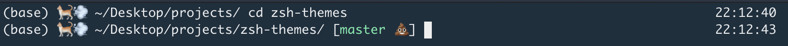
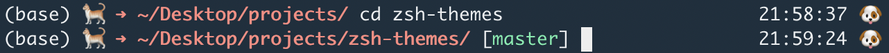
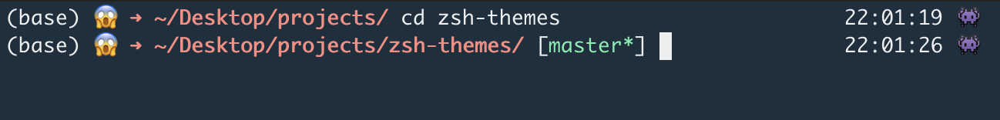
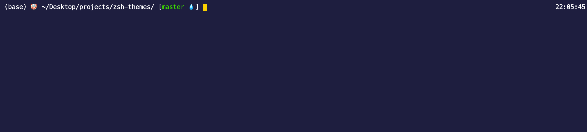

# ZSH Themes

Non-serious zsh themes for non-serious people

## Requirements

* [oh-my-zsh](https://ohmyz.sh/)
* rsync

Tested on MacOS 10.15


## Install
```
./install.sh
```

## Themes

#### Cat Fart


#### Cat Dog


#### Panic 


#### Clown

